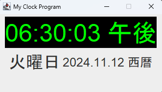
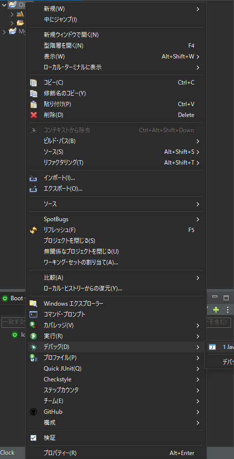

# Java時計

## 概要

Javaで作成した時計プログラムです。学びながら作りました。時計の機能を実現するために、JavaのGUIライブラリを使用しています。

## 機能

* 時計の表示
* 時間の更新
* 日付の表示



## 使い方

1. Pleiadesをインストールします。
2. Eclipseを実行します。
3. Clockを右クリック→デバック→Javaアプリケーションで実行します。



## 開発環境

* Java Development Kit (JDK)
 + バージョン: OpenJDK 21.0.1 (Temurin-21.0.1+12)
 + リリース日: 2023-10-17
 + LTS (Long Term Support)
* Pleiades　Eclipse
 + Version: 2023-12 (4.30.0)
 + Build id: 20231201-2043
* OS: Windows 11

## コード解説

### ウィンドウ設定部分
```java
this.setDefaultCloseOperation(JFrame.EXIT_ON_CLOSE); // ウィンドウを閉じたときに終了
this.setTitle("My Clock Program");                   // ウィンドウのタイトル
this.setLayout(new FlowLayout());                    // レイアウトの設定
this.setSize(350, 200);                              // サイズの固定
this.setResizable(false);                            // サイズ変更不可
```
* `this.setDefaultCloseOperation(JFrame.EXIT_ON_CLOSE);` : ウィンドウが閉じたときにプログラムが終了するように設定しています。
* this は、Java のプログラミング言語で使用されるキーワードです。this は、現在のオブジェクトを参照するために使用されます。
* this.setLayout(new FlowLayout());、このコードはウィンドウ内の部品（ボタンなど）を左から右に並べるための設定を行っています。
  ##### 詳しく解説
* this: ここでは、現在操作しているオブジェクト自身を指します。
* オブジェクトと車で例えると
  
| 変数（状態） | メソッド（動作） |
|---|---|
| 色 | 走る |
| メーカー | 止まる |
| 年式 | 曲がる |
* setLayout: このオブジェクトのレイアウトを設定するメソッドです。
* new FlowLayout(): FlowLayout（フローレイアウト）というレイアウトマネージャーの新しいインスタンスを作成します。FlowLayoutは、コンポーネントを左から右に、一行に収まりきらない場合は改行して並べるというシンプルな配置してます。
  ##### なぜ使うのか？
* 部品の配置を自動化: 手動で各部品の位置を指定する代わりに、FlowLayoutを使うことで、部品を追加するだけで自動的に適切な位置に配置されます。
* シンプルなレイアウトに最適。

### レイアウトとサイズ設定

* `this.setLayout(new FlowLayout());` : FlowLayoutを使って、ウィンドウ内の各要素（時刻、曜日、日付）を順番に配置しています。
* `this.setSize(350, 200);` : ウィンドウのサイズを固定し、見やすいレイアウトにしています。この配置は、他のGUIアプリケーションでも応用できます。
  ##### 詳しく解説
  ##### なぜ使うのか？

### 時間フォーマット設定
```java
timeFormat = new SimpleDateFormat("hh:mm:ss a");     // 時刻フォーマット
dayFormat = new SimpleDateFormat("EEEE");            // 曜日フォーマット
dateFormat = new SimpleDateFormat("yyyy.MM.dd G");   // 日付フォーマット
```
* `timeFormat = new SimpleDateFormat("hh:mm:ss a");` : SimpleDateFormatを用いて、時刻や日付の表示形式を設定しています。例えば、「hh:mm:ss a」で時間を「午前/午後」形式にフォーマットし、「EEEE」で曜日を表示しています。表示形式の指定はユーザーの利便性を高めます。
  ##### 詳しく解説
  ##### なぜ使うのか？

### ラベル設定（色とフォントのカスタマイズ）
```java
timeLabel = new JLabel();
timeLabel.setFont(new Font("", Font.PLAIN, 50));     // 時間表示用のフォントサイズとスタイル
timeLabel.setForeground(new Color(0x00FF00));        // 時間表示の文字色（緑）
timeLabel.setBackground(Color.black);                // 時間表示の背景色（黒）
timeLabel.setOpaque(true);                           // 背景を不透明に設定

dayLabel = new JLabel();
dayLabel.setFont(new Font("monospaced", Font.PLAIN, 35)); // 曜日表示用フォント設定

dateLabel = new JLabel();
dateLabel.setFont(new Font("", Font.PLAIN, 25));     // 日付表示用フォント設定

```
* `timeLabel.setFont(new Font("", Font.PLAIN, 50));` : 時間表示用のラベルにカスタムフォントを設定しています。
* `timeLabel.setForeground(new Color(0x00FF00));` : 時間表示用のラベルに文字色を設定しています。
* `timeLabel.setBackground(Color.black);` : 時間表示用のラベルに背景色を設定しています。
* `timeLabel.setOpaque(true);` : 時間表示用のラベルに背景を設定しています。このカスタマイズにより、見やすく視認性の高いデザインが実現されています。ユーザーが画面をすぐに読み取れるように工夫しています。
  ##### 詳しく解説
  ##### なぜ使うのか？

### 無限ループで時計を更新する部分
```java
while(true) {
    time = timeFormat.format(Calendar.getInstance().getTime());
    timeLabel.setText(time);
    day = dayFormat.format(Calendar.getInstance().getTime());
    dayLabel.setText(day);
    date = dateFormat.format(Calendar.getInstance().getTime());
    dateLabel.setText(date);

    try {
        Thread.sleep(1000);                         // 1秒ごとに更新
    } catch (InterruptedException e) {
        e.printStackTrace();
    }
}
```
* `while(true) {... }` : whileループを使って、1秒ごとに時刻と日付を更新しています。
* `Thread.sleep(1000);` : 1秒の待機時間を設けることで、毎秒ごとに正確な時刻を表示します。この仕組みによって、ユーザーがリアルタイムで時間の経過を確認できるようになります。
  ##### 詳しく解説
  ##### なぜ使うのか？

### 実行時のウィンドウプレビュー


* アプリケーションを実行したときの画面のスクリーンショットを追加します。時計が中央に配置され、現在の時刻、曜日、日付が見やすく表示されている様子を示します。アプリが実際に動作する様子を視覚的に確認できるため、プロジェクトの成果が一目でわかります。特にUIの配置や色のカスタマイズの効果がここで分かります。

## コード全体
```Main
public class Main {

	public static void main(String[] args) {
		
		new MyFrame();

	}

}
``` 
``` MyFrame
// インポートするライブラリ
import java.awt.Color;
import java.awt.FlowLayout;
import java.awt.Font;
import java.text.SimpleDateFormat;
import java.util.Calendar;

import javax.swing.JFrame;
import javax.swing.JLabel;

// MyFrameクラス: 時計のウィンドウを表示するために使用するクラス
public class MyFrame extends JFrame{
 
 // カレンダー: 日付と時間を取得するために使用するクラス
 Calendar calendar;
 
 // 日付と時間のフォーマット: SimpleDateFormatクラスを使用して日付と時間をフォーマットする
 SimpleDateFormat timeFormat;
 SimpleDateFormat dayFormat;
 SimpleDateFormat dateFormat;
 
 // ラベル: 時計のウィンドウに表示されるラベル
 JLabel timeLabel;
 JLabel dayLabel;
 JLabel dateLabel;
 
 // 日付と時間の文字列
 String time;
 String day;
 String date;

 // MyFrameクラスのコンストラクタ: 時計のウィンドウを初期化する
 MyFrame(){
  // ウィンドウの終了方法を設定する
  this.setDefaultCloseOperation(JFrame.EXIT_ON_CLOSE);
  // ウィンドウのタイトルを設定する
  this.setTitle("My Clock Program");
  // ウィンドウのレイアウトを設定する
  this.setLayout(new FlowLayout());
  // ウィンドウのサイズを設定する
  this.setSize(350,200);
  // ウィンドウのサイズを変更できるかどうかを設定する
  this.setResizable(false);
  
  // 日付と時間のフォーマットを設定する
  timeFormat = new SimpleDateFormat("hh:mm:ss a");
  dayFormat = new SimpleDateFormat("EEEE");
  dateFormat = new SimpleDateFormat("yyyy.MM.dd G");
  
  // ラベルを初期化する
  timeLabel = new JLabel();
  timeLabel.setFont(new Font("",Font.PLAIN,50));
  timeLabel.setForeground(new Color(0x00FF00));
  timeLabel.setBackground(Color.black);
  timeLabel.setOpaque(true);
  
  dayLabel = new JLabel();
  dayLabel.setFont(new Font("monospaced",Font.PLAIN,35));
  
  dateLabel = new JLabel();
  dateLabel.setFont(new Font("",Font.PLAIN,25));
  
  
  // ラベルをウィンドウに追加する
  this.add(timeLabel);
  this.add(dayLabel);
  this.add(dateLabel);
  // ウィンドウを表示する
  this.setVisible(true);
  
  // 時計を更新する
  setTime();
 }
 
 // 時計を更新するメソッド
 public void setTime() {
  // 無限ループで時計を更新する
  while(true) {
  // 日付と時間を取得する
  time = timeFormat.format(Calendar.getInstance().getTime());
  timeLabel.setText(time);
  
  day = dayFormat.format(Calendar.getInstance().getTime());
  dayLabel.setText(day);
  
  date = dateFormat.format(Calendar.getInstance().getTime());
  dateLabel.setText(date);
  
  // 1秒待つ
  try {
   Thread.sleep(1000);
  } catch (InterruptedException e) {
   e.printStackTrace();
  }
  }
 }
}
```
